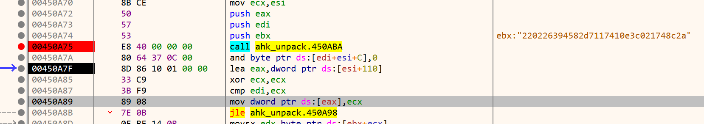
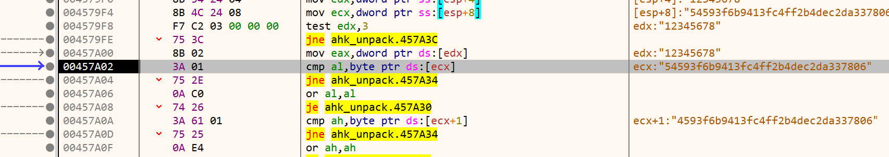

# Reversing.kr -- AutoHotkey1

## 1. Challenge

Just 2 files `ahk.exe` and `readme.txt`:

> -=-=-=-=-=-=-=-=-=-=-=-=-=-=-=-=-=-=-=-=-=-=-=-=-=-=-=-=-=-=-=-=-=-=-=-=-=-=-=-=-=-=-=-=-=-=-=-=-=-  
>   
> AuthKey = un_md5(DecryptKey) + " " + un_md5(EXE's Key)  
>   
> -=-=-=-=-=-=-=-=-=-=-=-=-=-=-=-=-=-=-=-=-=-=-=-=-=-=-=-=-=-=-=-=-=-=-=-=-=-=-=-=-=-=-=-=-=-=-=-=-=-  
>   
> Ex:)  
>  DecryptKey = 1dfb6b98aef3416e03d50fd2fb525600  
>  EXE's  Key = c944634550c698febdd9c868db908d9d  
>  => AuthKey = visual studio  
>   
> -=-=-=-=-=-=-=-=-=-=-=-=-=-=-=-=-=-=-=-=-=-=-=-=-=-=-=-=-=-=-=-=-=-=-=-=-=-=-=-=-=-=-=-=-=-=-=-=-=-  
>   
> By Pyutic  

Please goto [http://reversing.kr/challenge.php](http://reversing.kr/challenge.php) to download.

## 2. Solution

1. `ahk.exe` is packed by UPX because you can find a section named `UPX1` in `ahk.exe`. Please use UPX to unpack it.

   ```bash
   $ upx.exe -d -o ahk_unpacked.exe ahk.exe
   ```

2. Click `ahk_unpacked.exe` to run. But a dialog box poped up saying `EXE corrupted`. That means the program has self-check routine which is `sub_4508C7`.

   You can use `fix.c` to fix the program.

   ```bash
   $ gcc fix.c -o fix.exe
   $ fix.exe ahk_unpack.exe
   ```
 
   While debugging the program, you will see the first MD5 value after `call ahk_unpack.450ABA`:

   ```
   220226394582d7117410e3c021748c2a
   ```

   

   You can go to [http://www.cmd5.com](http://www.cmd5.com) to find the original text: __isolated__

3. After you run fixed `ahk_unpacked.exe`, you will be asked to input something. So let's set up breakpoints on `GetWindowTextA` at module `user32.dll`.

4. When the breakpoint triggered, find out the receive buffer and set hardware breakpoint on this buffer.

5. When the hardware breakpoint triggered, you will see the second MD5 value:

   ```
   54593f6b9413fc4ff2b4dec2da337806
   ```

   

   You can go to [http://www.cmd5.com](http://www.cmd5.com) to find the original text: __pawn__

6. Flag is __isolated pawn__