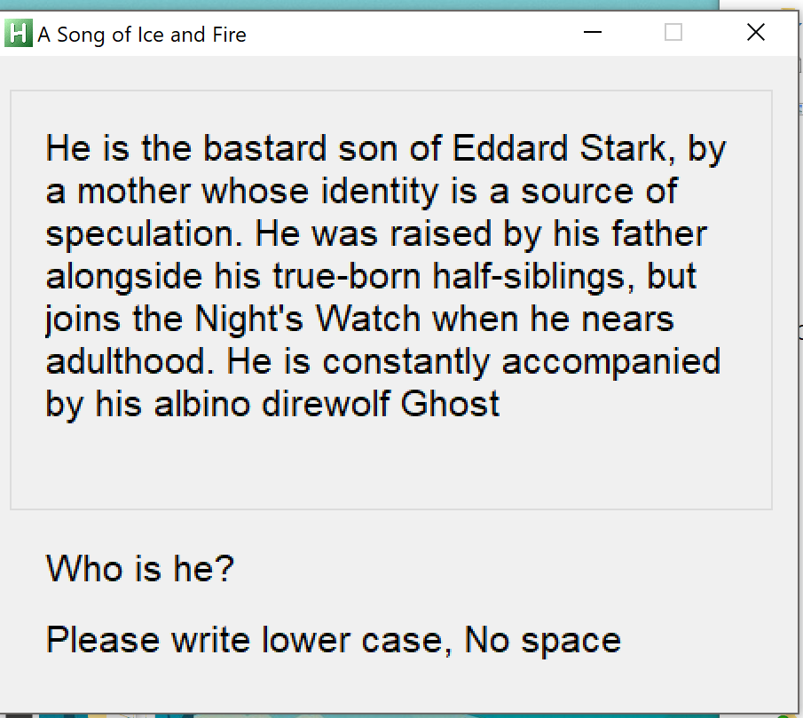

# Reversing.kr -- AutoHotkey2

## 1. Challenge

Just 2 files `AHK2.exe` and `ReadMe`:

> Reversing.Kr
> 
> It should be modified to work properly.
> 
> By rianatzz

Please goto [http://reversing.kr/challenge.php](http://reversing.kr/challenge.php) to download.

## 2. Solution

1. `AHK2.exe` has been packed by UPX, because you can find a section named `UPX1` in it. Please use UPX to unpack.

   ```bash
   $ upx -d -o AHK2_unpack.exe AHK2.exe
   ```

2. Double click `AHK2_unpack.exe` to run. However, a dialog box poped up saying `EXE corrupted`. 

3. I think we can use the C++ code `fix.c` in `AutoHotkey1` challenge to fix `AHK2_unpack.exe`.

   ```bash
   $ gcc fix.c -o fix.exe
   $ fix.exe AHK2_unpack.exe
   ```
4. Double click `AHK2_unpack.exe` to run again. Now it works:

   

5. Of course, he is Jon Snow. So the flag is __jonsnow__
