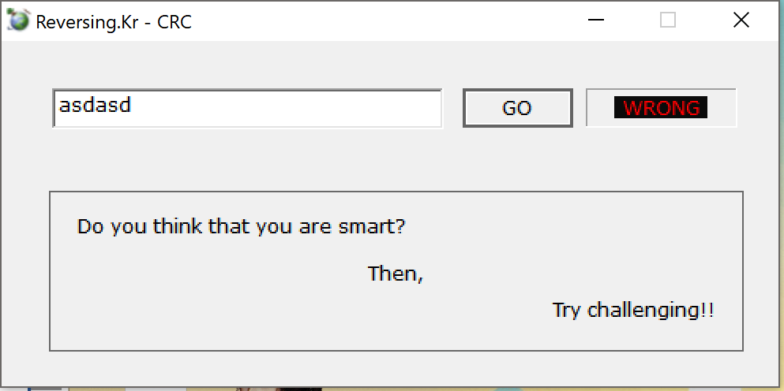
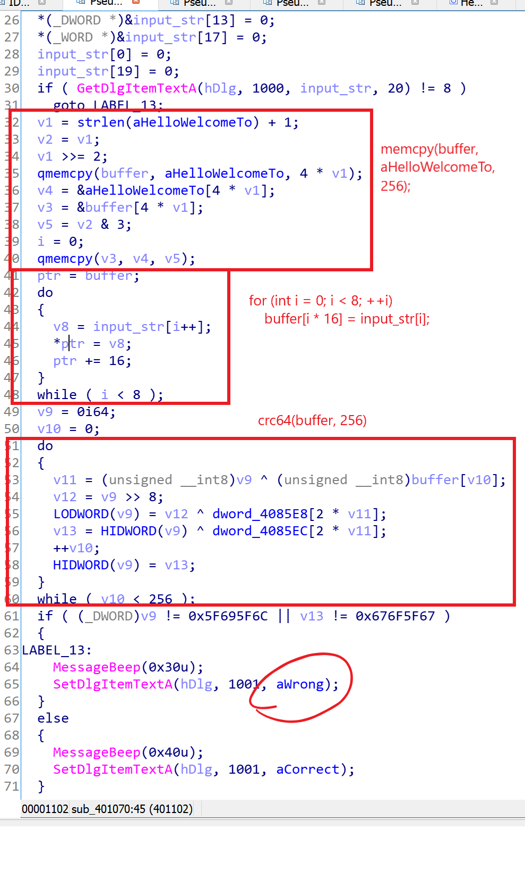
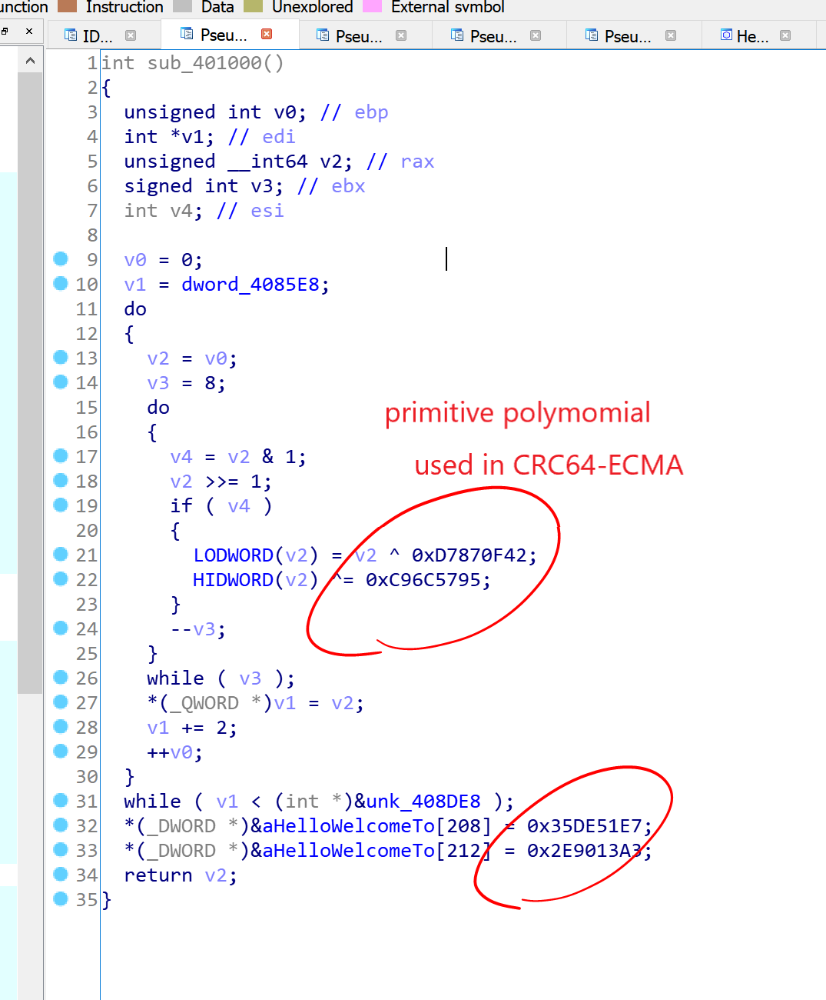

# Reversing.kr -- CRC1

## 1. Challenge

Just a file `CRC.exe`

Please goto [http://reversing.kr/challenge.php](http://reversing.kr/challenge.php) to download.

## 2. Solution

`CRC.exe` is a GUI program. You can type anything, but generally you will get a __WRONG__.



Let's go to IDA and find string `"WRONG"`:



Obviously, we must let `v9` and `v13` be equal to `0x5F695F6C` and `0x676F5F67` respectively so that we can get a `CORRECT`. `v9` and `v13` are set in previous do-while loop and highly related with `dword_4085E8`, `dword_4085EC` and `buffer`.

The type of `buffer` should be `uint8_t [256]` and is filled with `aHelloWelcomeTo` string at beginning. Then `buffer[0 * 16]`, `buffer[1 * 16]` ... `buffer[7 * 16]` are set to each chars of your input.

`dword_4085E8` and `dword_4085EC` are zeros and referenced in another function `sub_401000`:



I searched for the number `0xC96C5795D7870F42`, and it seems to be the primitive polymomial used in CRC64-ECMA algorithm.

So function `sub_401000` may be `CRC64_init()`. `dword_4085E8` and `dword_4085EC` should be the CRC64 look-up tables which store the low 32 bits part and the high 32 bits part respectively. Of course, some data in `aHelloWelcomeTo` string (from `aHelloWelcomeTo[208]` to `aHelloWelcomeTo[216 - 1]`) is also modified in `sub_401000`.

Now everything seems to be clear: 

1. We are given a block of data `aHelloWelcomeTo` whose length is 256 bytes. These 256 bytes will be copied to `uint8_t buffer[256]`.
   
2. We are asked to input 8 chars and each chars will be placed at `buffer[0 * 16]`, `buffer[1 * 16]` ... `buffer[7 * 16]`.

3. The program will calculate the CRC64 value of `uint8_t buffer[256]`. If the CRC64 value is `0x676F5F675F695F6C`, you will get a `CORRECT`. Otherwise you will get a `WRONG`.

So it is Math's time. How could we find these 8 chars? 

1. brute-force

   I'm afriad to say it is impossible. The length of seach space is `(0x7f - 0x20) ^ 8 = 6634204312890625`. It's too large.

2. Divide and Conquer

   We can split the 8 chars to the former 4 chars and the latter 4 chars.

   The former search space length is `(0x7f - 0x20) ^ 4 = 81450625`. So do the latter.

   We can calculate the CRC64 values of the former `4 * 16 = 64` bytes of `buffer` and get 81450625 possible values. Then reverse calculate the initial CRC64 values of the latter `256 - 4 * 16 = 192` bytes of `buffer` and get 81450625 possible values too. 
   
   There must be a CRC64 value that exists in both two 81450625 possible values. Find it and join the corresponding former 4 chars and latter 4 chars then you will get the flag.

   The relative C++ code is in `find_flag.c`. Please make sure you have at least 2.6GB free memory space.

   ```bash
   $ gcc -O2 find_flag.c -o find_flag.exe
   $ ./find_flag.exe
   ...
   ...
   [Map2] i = 0x78 done.
   [Map2] i = 0x79 done.
   [Map2] i = 0x7a done.
   [Map2] i = 0x7b done.
   [Map2] i = 0x7c done.
   [Map2] i = 0x7d done.
   [Map2] i = 0x7e done.
   [Map1] qsort done.
   [Map2] qsort done.
   flag = CrCA1g@!
   ```