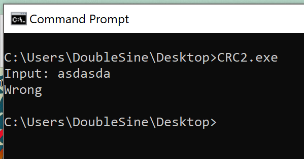
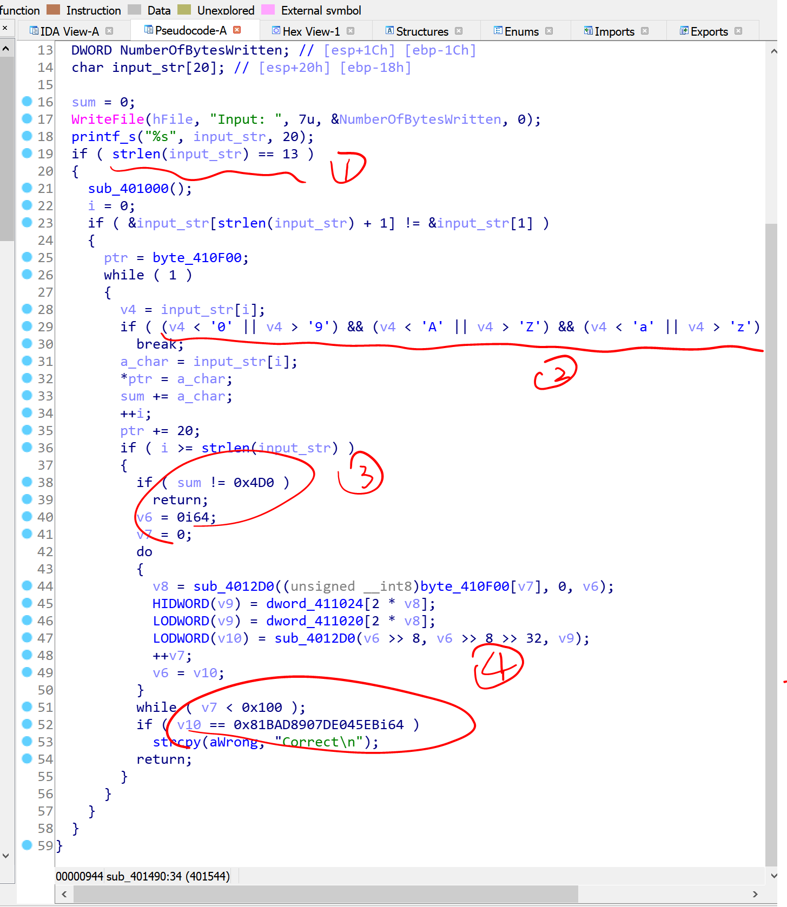

# Reversing.kr -- CRC2

## 1. Challenge

Just a file `CRC2.exe`

Please goto [http://reversing.kr/challenge.php](http://reversing.kr/challenge.php) to download.

## 2. Solution

`CRC2.exe` is console application. You will be asked to type something, but generally you will get a `Wrong`.



We can drop it into IDA. However, you can find that there is a lot of obscure code in `sub_401490`, `sub_401000` and `sub_4012D0` which looks like

```asm
push    33h
call    $+5
add     dword ptr [esp], 5
retf
..
..
call    $+5
mov     dword ptr [esp+4], 23h
add     dword ptr [esp], 0Dh
retf
```

Actually these instructions are Wow64 switch code. The instruction `retf` will not only pop an address to `EIP` but also pop a dword to `CS` register which will be modified to the low 16 bits of the dword.

After the following 4 instructions

```asm
push    33h
call    $+5
add     dword ptr [esp], 5
retf
```

`EIP` will be modified to the address of the next instruction of `retf`. And the most important, `CS` register will be modified to `0x0033` which means switch current mode from 32-bits mode to 64-bits mode. In other words, the program escapes from Wow64 environment to native 64-bits environment.

After the following 4 instructions

```asm
call    $+5
mov     dword ptr [esp+4], 23h
add     dword ptr [esp], 0Dh
retf
```

`CS` register will be modified to `0x0023` which means go back to Wow64 environment.

For detail, you look at [this](https://int0h.wordpress.com/2009/12/24/the-power-of-wow64/).

We can just wipe these instrctions out for there is no x64 instrctions in this program.

```python
f = open('CRC2.exe', 'rb')
content = f.read()
f.close()

content = content.replace(b'\x6A\x33\xE8\x00\x00\x00\x00\x83\x04\x24\x05\xCB', b'\x90' * 12)
content = content.replace(b'\xE8\x00\x00\x00\x00\xC7\x44\x24\x04\x23\x00\x00\x00\x83\x04\x24\x0D\xCB', b'\x90' * 18)

f = open('CRC2_patched.exe', 'wb')
f.write(content)
f.close()
```

Now drop `CRC2_patched.exe` to IDA. This time, everything seems to be clear. You can use F5 to see the decompiled code of `sub_401490`.



Based on `sub_401490`, we can know that

1. You should input a 13-chars-long string.

2. Each chars of your input must be alphabetic or numerical.

3. The sum of each chars must be `0x4D0`.

4. The 13 chars of your input will be stored at `byte_410F00[0 * 20]`, `byte_410F00[1 * 20]` ... `byte_410F00[12 * 20]`. The CRC64 value of `byte_410F00` which is 256 bytes long must be `0x81BAD8907DE045EB`.

Notice: 

`dword_411020` and `dword_411024` are CRC64 look-up tables which store the low 32 bits and the high 32 bits respectively. 

They are initialized in `sub_401000`. The primitive polymomial used by this CRC64 algorithm is `0x8C997D55124358A1` which is customed.

`byte_410F00` is initilized in `sub_401000`. the content after initilization is

```cpp
uint8_t byte_410F00[256] = {
    0x42, 0x4d, 0x96, 0x02, 0x36, 0x28, 0x32, 0x04, 0x01, 0x18, 0x60, 0x02, 0xe7, 0xbf, 0xc8, 0xc8, 
    0xe0, 0xdd, 0xf2, 0xff, 0xc8, 0xe0, 0xdd, 0x24, 0x1c, 0xed, 0xc8, 0xe0, 0xdd, 0xcc, 0x48, 0x3f, 
    0xe8, 0xa2, 0x57, 0x7a, 0xb9, 0xc8, 0xe0, 0xdd, 0xc8, 0xe0, 0xdd, 0x1d, 0xe6, 0xb5, 0xcc, 0x48, 
    0x3f, 0xc8, 0xe0, 0xdd, 0xc8, 0xe0, 0xdd, 0x4c, 0xb1, 0x22, 0x7f, 0x7f, 0x7f, 0xc8, 0xe0, 0xdd, 
    0xc8, 0xe0, 0xdd, 0xc8, 0xe0, 0xdd, 0xf2, 0xff, 0x4c, 0xb1, 0x22, 0xc8, 0xe0, 0xdd, 0xc8, 0xe0, 
    0xdd, 0xcc, 0x48, 0x3f, 0xc8, 0xe0, 0xdd, 0xc8, 0xe0, 0xdd, 0x7f, 0x7f, 0x7f, 0x24, 0x1c, 0xed, 
    0xcc, 0x48, 0x3f, 0xc8, 0xe0, 0xdd, 0xc8, 0xe0, 0xdd, 0x24, 0x1c, 0xed, 0x27, 0x7f, 0xff, 0xc8, 
    0xe0, 0xdd, 0xc8, 0xe0, 0xdd, 0x1d, 0xe6, 0xb5, 0xc8, 0xe0, 0xdd, 0xc8, 0xe0, 0xdd, 0x9a, 0x76, 
    0x83, 0xc8, 0xe0, 0xdd, 0x57, 0x7a, 0xb9, 0xc8, 0xe0, 0xdd, 0xc8, 0xe0, 0xdd, 0x4c, 0xb1, 0x22, 
    0xe8, 0xa2, 0x24, 0x1c, 0xed, 0xc9, 0xae, 0xff, 0x24, 0x1c, 0xed, 0xcc, 0x48, 0x3f, 0xc8, 0xe0, 
    0xdd, 0x4c, 0xb1, 0x22, 0xc8, 0xe0, 0xdd, 0xc8, 0xe0, 0xdd, 0xc8, 0xe0, 0xdd, 0xc8, 0xe0, 0xdd, 
    0xc8, 0xe0, 0xdd, 0x24, 0x1c, 0xed, 0xc8, 0xe0, 0xdd, 0x27, 0x7f, 0xff, 0xc8, 0xe0, 0xdd, 0xc8, 
    0xe0, 0xdd, 0xc8, 0xe0, 0xdd, 0xc9, 0xae, 0xff, 0xc8, 0xe0, 0xdd, 0xc8, 0xe0, 0xdd, 0xc8, 0xe0, 
    0xdd, 0x57, 0x7a, 0xb9, 0xc8, 0xe0, 0xdd, 0x24, 0x1c, 0xed, 0xc8, 0xe0, 0xdd, 0xc8, 0x00, 0x00, 
    0x00, 0x00, 0x00, 0x00, 0x00, 0x00, 0x00, 0x00, 0x00, 0x00, 0x00, 0x00, 0x00, 0x00, 0x00, 0x00, 
    0x00, 0x00, 0x00, 0x00, 0x00, 0x00, 0x00, 0x00, 0x00, 0x00, 0x00, 0x00, 0x00, 0x00, 0x00, 0x00
};
```

---

Now it's Math's time again. How could we find these 13 chars?

1. brute-force

   No way! This time, the length of search space is even larger: `(10 + 26 + 26) ^ 13 = 200028539268669788905472`. It's too scaring.

2. Divide and Conquer

   No, we can't. Each part has `(10 + 26 + 26) ^ 6 = 56800235584` possibe values which will cost 423GB approximately. We have no such large memory.

3. Matrix

   CRC function has a interesting property that is linear:

   ```
   CRC(x) XOR CRC(y) = CRC(x XOR y)
   ```

   Suppose that `x XOR y` is the final text we want to get and `y` is the text that is almost the same with `x XOR y` and only has 13 chars different with it. So `x` must the text that is with a lot of zeros and only 13 non-zero chars.

   ```
   index:   0  1  2  3  ... 16 17 18 ... 32 33 34 ...... 192 193 194 ......

   x XOR y: X0 4d 96 02 ... X1 dd f2 ... X2 a2 57 ...... X12 dd  c8  ......
   
                X0, X1, X2... are each chars of answer(flag)

   y      : 30 4d 96 02 ... 30 dd f2 ... 30 a2 57 ...... 30  dd  c8  ......

   x      : Y0 00 00 00 ... Y1 00 00 ... Y2 00 00 ...... Y12 00  00  ......

                Yi = Xi XOR 0x30
   ```

   We can split `x` to `13 * 8 = 104` masks and each of masks has only one bit that is set to `1`. 
   
   Of course, the number of masks can be reduced to `13 * 7 = 91` because each of 13 chars is alphabetic or numerical so the highest bit of each chars must be `0`.

   ```
   index:   0  1  2  3  ... 16 17 18 ... 32 33 34 ...... 192 193 194 ......

   x      : Y0 00 00 00 ... Y1 00 00 ... Y2 00 00 ...... Y12 00  00  ......

   mask0  : 01 00 00 00 ... 00 00 00 ... 00 00 00 ...... 00  00  00  ......
   mask1  : 02 00 00 00 ... 00 00 00 ... 00 00 00 ...... 00  00  00  ......
   mask2  : 04 00 00 00 ... 00 00 00 ... 00 00 00 ...... 00  00  00  ......
   mask3  : 08 00 00 00 ... 00 00 00 ... 00 00 00 ...... 00  00  00  ......
   mask4  : 10 00 00 00 ... 00 00 00 ... 00 00 00 ...... 00  00  00  ......
   mask5  : 20 00 00 00 ... 00 00 00 ... 00 00 00 ...... 00  00  00  ......
   mask6  : 40 00 00 00 ... 00 00 00 ... 00 00 00 ...... 00  00  00  ......

   mask7  : 00 00 00 00 ... 01 00 00 ... 00 00 00 ...... 00  00  00  ......
   mask8  : 00 00 00 00 ... 02 00 00 ... 00 00 00 ...... 00  00  00  ......
   mask9  : 00 00 00 00 ... 04 00 00 ... 00 00 00 ...... 00  00  00  ......
   mask10 : 00 00 00 00 ... 08 00 00 ... 00 00 00 ...... 00  00  00  ......
   mask11 : 00 00 00 00 ... 10 00 00 ... 00 00 00 ...... 00  00  00  ......
   mask12 : 00 00 00 00 ... 20 00 00 ... 00 00 00 ...... 00  00  00  ......
   mask13 : 00 00 00 00 ... 40 00 00 ... 00 00 00 ...... 00  00  00  ......

   ...
   ...

   mask84 : 00 00 00 00 ... 00 00 00 ... 00 00 00 ...... 01  00  00  ......
   mask85 : 00 00 00 00 ... 00 00 00 ... 00 00 00 ...... 02  00  00  ......
   mask86 : 00 00 00 00 ... 00 00 00 ... 00 00 00 ...... 04  00  00  ......
   mask87 : 00 00 00 00 ... 00 00 00 ... 00 00 00 ...... 08  00  00  ......
   mask88 : 00 00 00 00 ... 00 00 00 ... 00 00 00 ...... 10  00  00  ......
   mask89 : 00 00 00 00 ... 00 00 00 ... 00 00 00 ...... 20  00  00  ......
   mask90 : 00 00 00 00 ... 00 00 00 ... 00 00 00 ...... 40  00  00  ......

   ```

   Let `Fi` be the flag that represents `maski` is present or not. So we have `F0`, `F1`, `F2` ... `F90`

   Let `CRC64(maski)` be the CRC64 value of `maski` and `CRC64(maski)j` means the `j`th bit of `CRC64(maski)`.

   So we have a matrix equation over GF(2):

   ```
                                                           -------
                                                           | F0  |
   -----------------------------------------------------   | F1  |   --------------
   | CRC64(mask0)0  CRC64(mask1)0  ... CRC64(mask90)0  |   | F2  |   | CRC64(x)0  |
   | CRC64(mask0)1  CRC64(mask1)1  ... CRC64(mask90)1  |   | F3  |   | CRC64(x)1  |
   | CRC64(mask0)2  CRC64(mask1)2  ... CRC64(mask90)2  |   | ... |   | CRC64(x)2  |
   | CRC64(mask0)3  CRC64(mask1)3  ... CRC64(mask90)3  | * | ... | = | CRC64(x)3  |
   | ....           ..             ... ...             |   | ... |   | ...        |
   | ....           ..             ... ...             |   | ... |   | ...        |
   | CRC64(mask0)63 CRC64(mask1)63 ... CRC64(mask90)63 |   | ... |   | CRC64(x)63 |
   -----------------------------------------------------   | F88 |   --------------
                                                           | F89 |
                                                           | F90 |
                                                           -------
   ```

   This equation has 27 solution vectors. I've write a sage script to find them out. You can run it under SageMath.

   ```bash
   $ ./crc2.sage
   -----Particular Solution-----
   { 0x74, 0x0c, 0x3f, 0x09, 0x39, 0x03, 0x36, 0x77, 0x29, 0x00, 0x00, 0x00, 0x00 }
   -----Genernal Solution-----
   { 0x01, 0x00, 0x00, 0x00, 0x34, 0x79, 0x10, 0x7d, 0x1d, 0x37, 0x36, 0x04, 0x63 }
   { 0x02, 0x00, 0x00, 0x00, 0x46, 0x65, 0x04, 0x3c, 0x05, 0x47, 0x05, 0x28, 0x0b }
   { 0x04, 0x00, 0x00, 0x00, 0x46, 0x79, 0x3f, 0x1b, 0x02, 0x4d, 0x2c, 0x1d, 0x32 }
   { 0x08, 0x00, 0x00, 0x00, 0x46, 0x41, 0x49, 0x55, 0x0c, 0x59, 0x7e, 0x77, 0x40 }
   { 0x10, 0x00, 0x00, 0x00, 0x09, 0x76, 0x72, 0x6a, 0x33, 0x06, 0x2a, 0x00, 0x16 }
   { 0x20, 0x00, 0x00, 0x00, 0x79, 0x08, 0x41, 0x1b, 0x14, 0x53, 0x63, 0x05, 0x0a }
   { 0x40, 0x00, 0x00, 0x40, 0x7e, 0x42, 0x5d, 0x16, 0x23, 0x0f, 0x2c, 0x6f, 0x49 }
   { 0x00, 0x01, 0x00, 0x00, 0x31, 0x1b, 0x21, 0x30, 0x19, 0x5e, 0x1d, 0x3e, 0x02 }
   { 0x00, 0x02, 0x00, 0x40, 0x29, 0x57, 0x79, 0x2f, 0x56, 0x12, 0x7a, 0x31, 0x3f }
   { 0x00, 0x04, 0x00, 0x40, 0x1f, 0x7c, 0x0c, 0x5b, 0x66, 0x6f, 0x19, 0x52, 0x5a }
   { 0x00, 0x08, 0x00, 0x00, 0x77, 0x0c, 0x0a, 0x5f, 0x41, 0x4c, 0x6f, 0x7a, 0x19 }
   { 0x00, 0x10, 0x00, 0x00, 0x59, 0x18, 0x58, 0x62, 0x77, 0x3c, 0x5d, 0x5a, 0x73 }
   { 0x00, 0x20, 0x00, 0x40, 0x0b, 0x22, 0x46, 0x5e, 0x32, 0x04, 0x27, 0x72, 0x77 }
   { 0x00, 0x40, 0x00, 0x00, 0x44, 0x06, 0x22, 0x6b, 0x26, 0x5d, 0x68, 0x45, 0x3d }
   { 0x00, 0x00, 0x01, 0x40, 0x5a, 0x12, 0x2c, 0x2a, 0x7e, 0x30, 0x32, 0x44, 0x15 }
   { 0x00, 0x00, 0x02, 0x40, 0x54, 0x06, 0x24, 0x40, 0x6b, 0x4a, 0x21, 0x17, 0x58 }
   { 0x00, 0x00, 0x04, 0x00, 0x47, 0x1b, 0x4d, 0x63, 0x28, 0x5f, 0x2c, 0x5b, 0x04 }
   { 0x00, 0x00, 0x08, 0x40, 0x08, 0x50, 0x13, 0x4c, 0x35, 0x16, 0x1c, 0x55, 0x0c }
   { 0x00, 0x00, 0x10, 0x40, 0x4a, 0x63, 0x74, 0x1e, 0x48, 0x5d, 0x17, 0x02, 0x16 }
   { 0x00, 0x00, 0x20, 0x40, 0x72, 0x16, 0x63, 0x7d, 0x69, 0x57, 0x19, 0x06, 0x2c }
   { 0x00, 0x00, 0x40, 0x00, 0x4e, 0x48, 0x42, 0x10, 0x61, 0x13, 0x02, 0x5c, 0x07 }
   { 0x00, 0x00, 0x00, 0x41, 0x61, 0x22, 0x59, 0x03, 0x3a, 0x5f, 0x4e, 0x3e, 0x79 }
   { 0x00, 0x00, 0x00, 0x42, 0x1d, 0x73, 0x00, 0x40, 0x7d, 0x7b, 0x65, 0x3a, 0x6a }
   { 0x00, 0x00, 0x00, 0x04, 0x78, 0x60, 0x36, 0x30, 0x7e, 0x67, 0x69, 0x52, 0x49 }
   { 0x00, 0x00, 0x00, 0x08, 0x69, 0x57, 0x04, 0x7a, 0x36, 0x43, 0x38, 0x2a, 0x1e }
   { 0x00, 0x00, 0x00, 0x10, 0x19, 0x5b, 0x4d, 0x64, 0x03, 0x47, 0x06, 0x67, 0x71 }
   { 0x00, 0x00, 0x00, 0x60, 0x57, 0x21, 0x34, 0x03, 0x7a, 0x32, 0x40, 0x5f, 0x6b }
   ```

   27 solution vectors means we have `2 ^ 27 = 134217728` possible solutions. 
   
   Well that's acceptable. We can use brute force to test all of solutions and find the flag out.

   I've write C++ code to find the flag.

   ```bash
   $ gcc -O2 find_flag.c -o find_flag.exe
   $ ./find_flag.exe
   4m8yZpasIzLwZ
   Qmz8TVmKQZtqn
   5gDzuuPaYgxj9
   jkfrWRXQLwiPU
   IWIuQtOxzhMtC
   3ytu8E0evjtdq
   dqXtPgZMsSev0
   Oy7wknbvu67Qv
   rcLwXkRsAWQuR
   hqrvclx277vbP
   FDniQqtPKmgvT
   8yfmbqt1tP1gx
   sF5lauSshJsoF
   SdVaxWoWwJZfL
   HyieDEHiNzOzv
   goodRevKrF0rU  <-- see this!!!
   PzmgIVfjkM5cs
   6aNfexyvdUBxF
   lvcXi1MPeYuyP
   tIzPuvyJBiK8m
   IQiUBhmrYpwNa
   yftI0JmNryxi3
   3ghKglvpiYpQG
   ez6MjBglkJahq
   zlMLoxMISCYwn
   Ro4NqqwMrAdyW
   1tfNbRgmfUyYb
   MvlAt1ZnkUsVj
   onxCuCtIQHy8y
   pgjDRRpn6l4yz
   ```

Now just submit the flag and win points.

