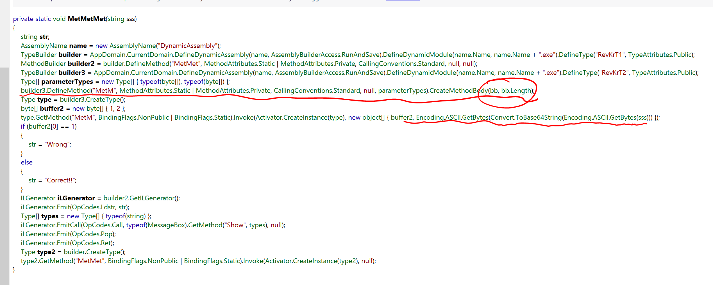
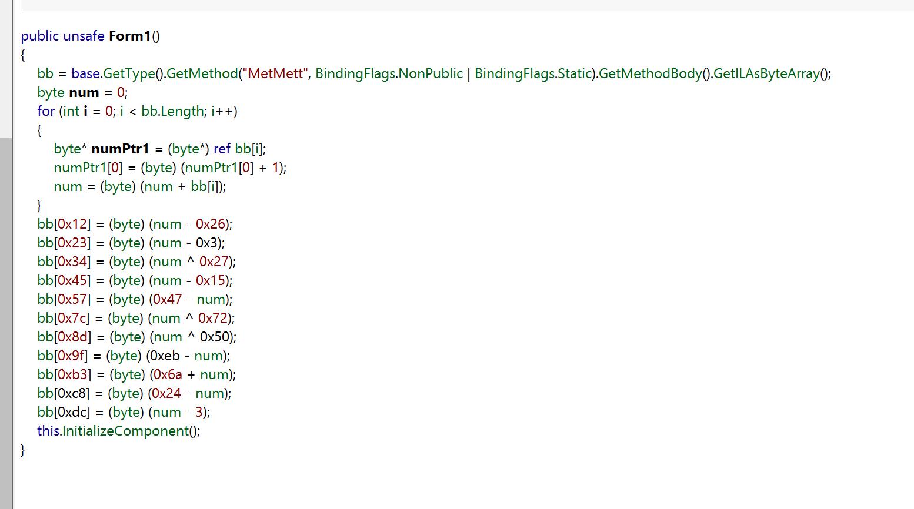
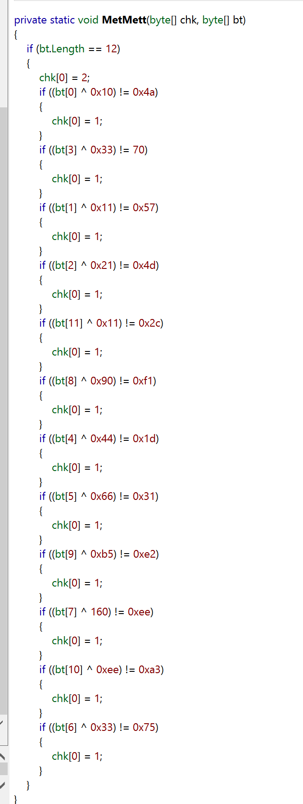

# Reversing.kr -- CSHARP

## 1. Challenge

Just a file `CSharp.exe`

Please goto [http://reversing.kr/challenge.php](http://reversing.kr/challenge.php) to download.

## 2. Solution

This is C# application. So we can use .Net Reflector to decompile.




It seems that this application load a function dynamicly from `bb` which is initialized in `Form1.ctor()`.



So `bb` is initialized by opcodes of `MetMett` function at beginning. Then there are some decrypting-like operations towards `bb`.

So I write C++ code to patch `CSharp.exe`.

```bash
$ gcc patch.cpp -o patch.exe
$ ./patch.exe CSharp.exe
```

Now function `MetMett` is revealed:



I think it is not hard to write the decrypt script now.

```python
import base64

encrypted_password = b'\x4a\x57\x4d\x46\x1d\x31\x75\xee\xf1\xe2\xa3\x2c'
mask = b'\x10\x11\x21\x33\x44\x66\x33\xa0\x90\xb5\xee\x11'

password = []
for i in range(len(encrypted_password)):
    password.append(encrypted_password[i] ^ mask[i])
password = base64.b64decode(bytes(password).decode())

print(password.decode())
```

The answer is __dYnaaMic__

