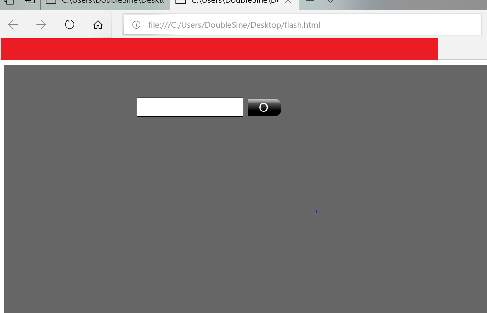
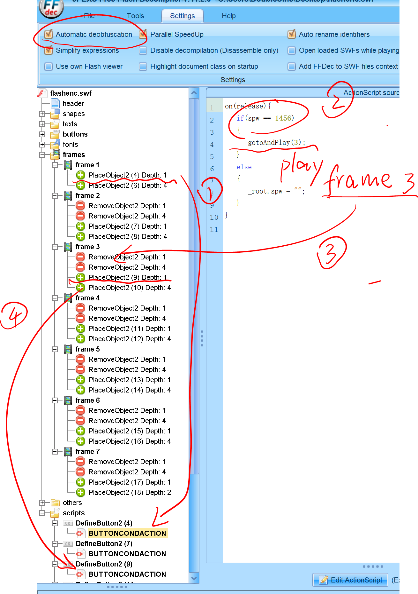
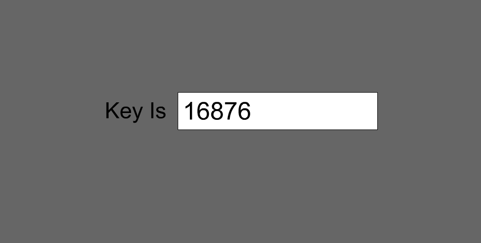

# Reversing.kr -- Flash Encrypt

## 1. Challenge

Just a file and a `flashenc.swf`:

Please goto [http://reversing.kr/challenge.php](http://reversing.kr/challenge.php) to download.

## 2. Solution

First let's try to play this flash file.

1. Create a html file at the folder where `flashenc.swf` locates with the following content:

```html
<object>
    <embed src="flashenc.swf" width="100%" height="100%"></embed>
</object>
```

2. Open this html file with Microsoft Edge or Google Chrome.

   

   Okay, with only a textbox and a button.

Now use [ffdec](https://github.com/jindrapetrik/jpexs-decompiler) to decompile.

Don't forget to check `Automatic deobfuscation`



1. We can see that `object 4` and `object 6` are added in `frame 1` while `object 4` just is a button so we can go to see the corresponding script.

2. We can see `spw == 1456`. So just input `1456` and click button.

3. The next frame is `frame 3` and we can see `object 9` are added. 

4. Go to see the corresponding script and find the pass text.

This challenge is simple. The pass texts are:

1. `1456`

2. `25`

3. `44`

4. `8`

5. `88`

6. `20546`

Finally you will see the flag.


