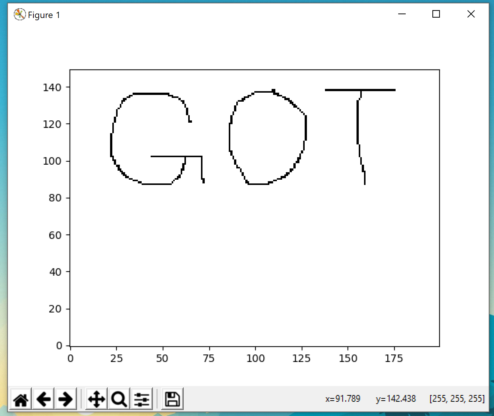

# Reversing.kr -- ImagePrc

## 1. Challenge

Just a exe file `ImagePrc.exe`.

Please goto [http://reversing.kr/challenge.php](http://reversing.kr/challenge.php) to download.

## 2. Solution

Double click `ImagePrc.exe` to run and you will see a window poped up. 

You can use mouse to draw anything but a dialog box saying "Wrong" always poped up when you click `Check` button.

So let't drop it into IDA.

The dialog function is `sub_401130`. After reading decompilered code, you will find that a resource is loaded.

Use [Resource Hacker](http://angusj.com/resourcehacker/) to find the corresponding resource. I've extracted it into `image.raw`. 

You can use Python to display this image:

```bash
$ ./ImagePrc.py
```



So the flag is __GOT__
