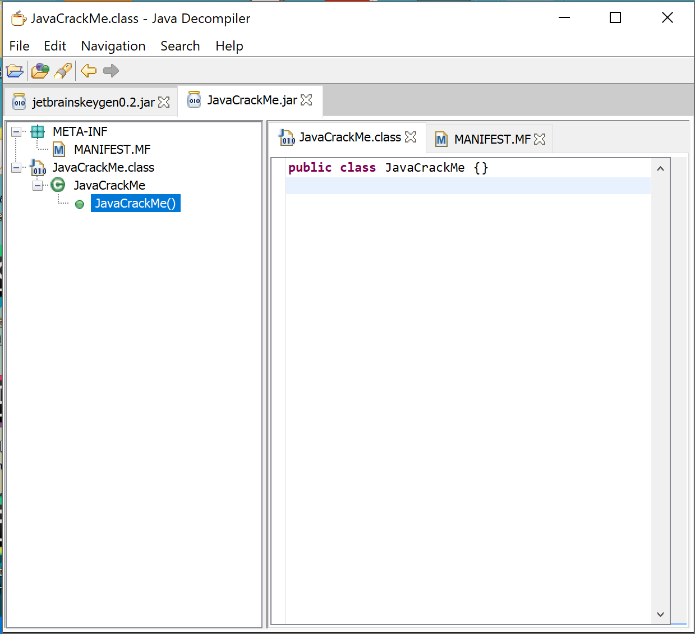
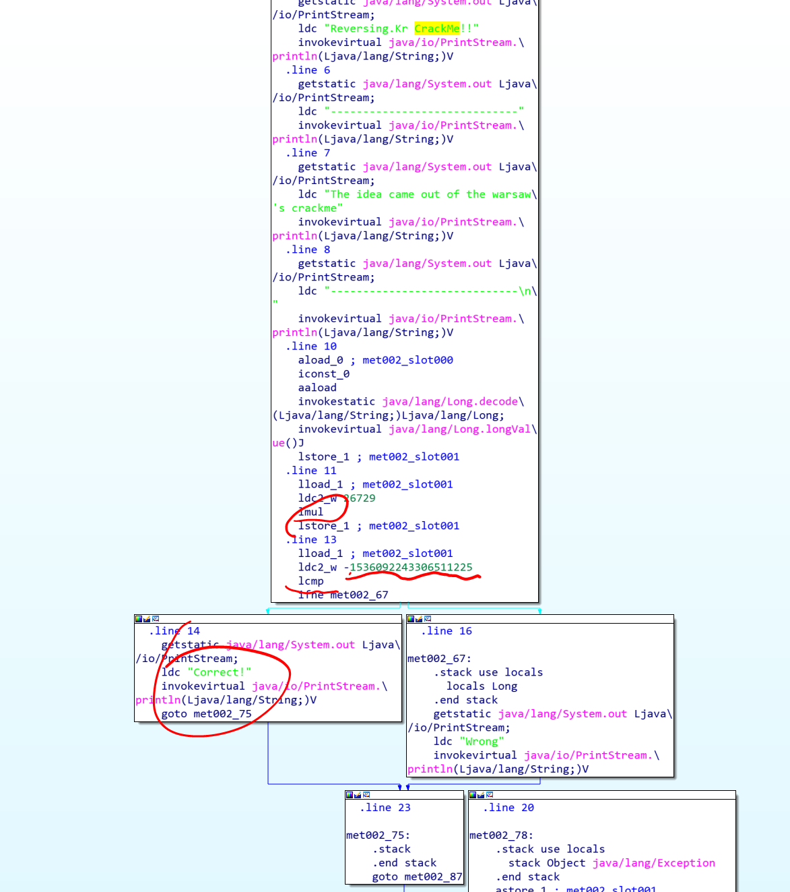

# Reversing.kr -- Multiplicative

## 1. Challenge

Just a jar file `JavaCrackMe.jar`:

Please goto [http://reversing.kr/challenge.php](http://reversing.kr/challenge.php) to download.

## 2. Solution

When I got the jar file, the first thing I did is to use __JD-GUI__ to decompiler this jar file. However I got nothing. 



So I have to use IDA.



Now it seems that the program will convert `argv[1]` to a int64, then multiply `26729` and finally compare with `-1536092243306511225`.

So what we have to do is to find a int64 `x` so that 

```
x * 26729 == -1536092243306511225
``` 

It seems impossible. But don't forget that multiplication in java can overflow. So what we actually have to find is 

```
x * 26729 == k * 2**64 - 1536092243306511225
```

Here's the code to find `x`

```python
k = 0
while True:
    if (k * 2 ** 64 - 1536092243306511225) % 26729 == 0:
        print('k = %d' % k)
        break
    else:
        k += 1

x = (k * 2**64 - 1536092243306511225) // 26729
if x > 0x7fffffffffffffff:
    x -= 2 ** 64

print('x = %d' % x)
```

The result is
```
k = 13720
x = -8978084842198767761
```

Now run the program again and pass the `x`

```
$ java -jar ./JavaCrackMe.jar -8978084842198767761
Reversing.Kr CrackMe!!
-----------------------------
The idea came out of the warsaw's crackme
-----------------------------

Correct!
```

So the flag is __-8978084842198767761__

