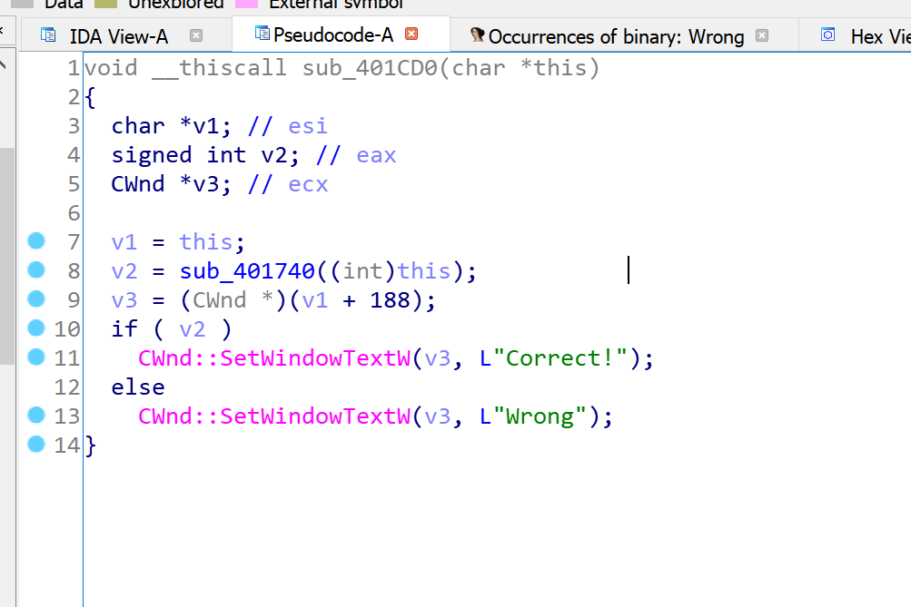

# Reversing.kr -- Position

## 1. Challenge

Just 2 files `Position.exe` and `ReadMe.txt`:

> ReversingKr KeygenMe  
>   
>   
> Find the Name when the Serial is 76876-77776  
> This problem has several answers.  
>   
> Password is ***p  

Please goto [http://reversing.kr/challenge.php](http://reversing.kr/challenge.php) to download.

## 2. Solution

Well this challenge is similar to __Easy Keygen__.

Drop `Position.exe` into IDA.

Search Unicode string "Wrong". You will find function `sub_401CD0`.



It's obvious that everything depends on `sub_401740`.

`sub_401740` is long but not complex. I believe you can handle it. So I just write a python script to find flag.

```bash
$ ./Position.py
bump
```

So the flag is __bump__
