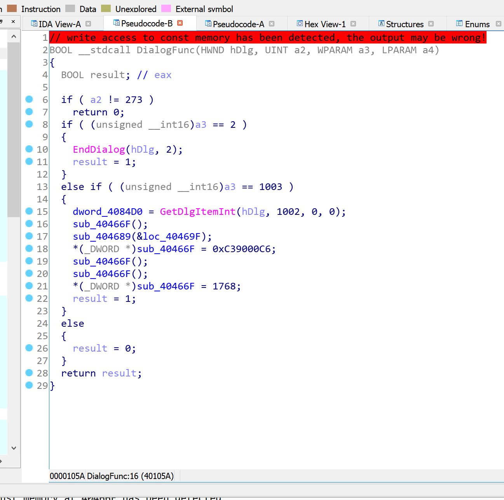
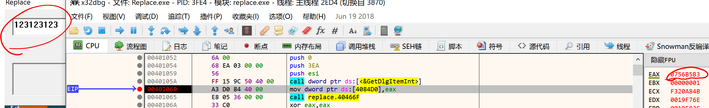
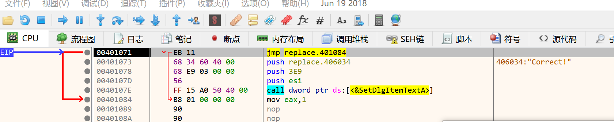
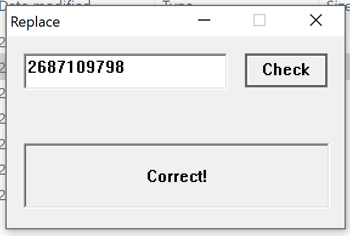

# Reversing.kr -- Replace

## 1. Challenge

Just a file `Replace.exe`

Please goto [http://reversing.kr/challenge.php](http://reversing.kr/challenge.php) to download.

## 2. Solution

Drop it into IDA and go to see function `DialogFunc`

It seems that the program does a lot of tricks. Static analysis may be hard, so let's use x32dbg.

Set a breakpoint at `replace.00401060`. After you input a number and click `Check` button, the breakpoint will be triggered. 

`EAX` stores the integer we input. Let's see how the program will handle this interger.

1. The integer will be store at `replace.004084D0`.

2. The integer stored at `replace.004084D0` will be added `1` at `EIP = replace.00404689`.

3. The integer stored at `replace.004084D0` will be added `1` again at `EIP = replace.00404689`.

4. The integer stored at `replace.004084D0` will be added `0x601605C7` at `EIP = replace.00404674`.

5. The integer stored at `replace.004084D0` will be added `1` at `EIP = replace.00404689`.

6. The integer stored at `replace.004084D0` will be added `1` again at `EIP = replace.00404689`.

7. The integer stored at `replace.004084D0` will be moved to `EAX` register at `EIP = replace.00404690`.

8. The integer stored at `replace.004084D0` will be added `1` at `EIP = replace.00404689`.

9. The integer stored at `replace.004084D0` will be added `1` again at `EIP = replace.00404689`.

10. The byte stored at `EAX` address will be set to `0x90`. So `EAX` must be a valid address, otherwise an access violation will occur. After that, the program will return to `replace.004046AE`.

11. Increate `EAX` by 1, then call `replace.40466F` again. Repeat step 10 and return to `replace.004046B4`.

12. Then there will be a big jump to `replace.00401071`. 

However, the instruction at `replace.00401071` just bypass the call towards `SetDlgItemTextA`.

We must wipe the instruction at `replace.00401071` out so that we can get a `Correct`.

As far as step 10 and step 11 are concerned, we just make sure that `EAX` is `0x00401071` before step 10 so that the instruction at `replace.00401071` will be replaced by two `nop`.

Let x be the input integer. `EAX` is set at step 7. Following step 1 to step 7, we can know that `EAX = x + 1 + 1 + 0x601605C7 + 1 + 1`. So `x` must be `0xA02A0AA6 = 2687109798`.

So the flag is __2687109798__

