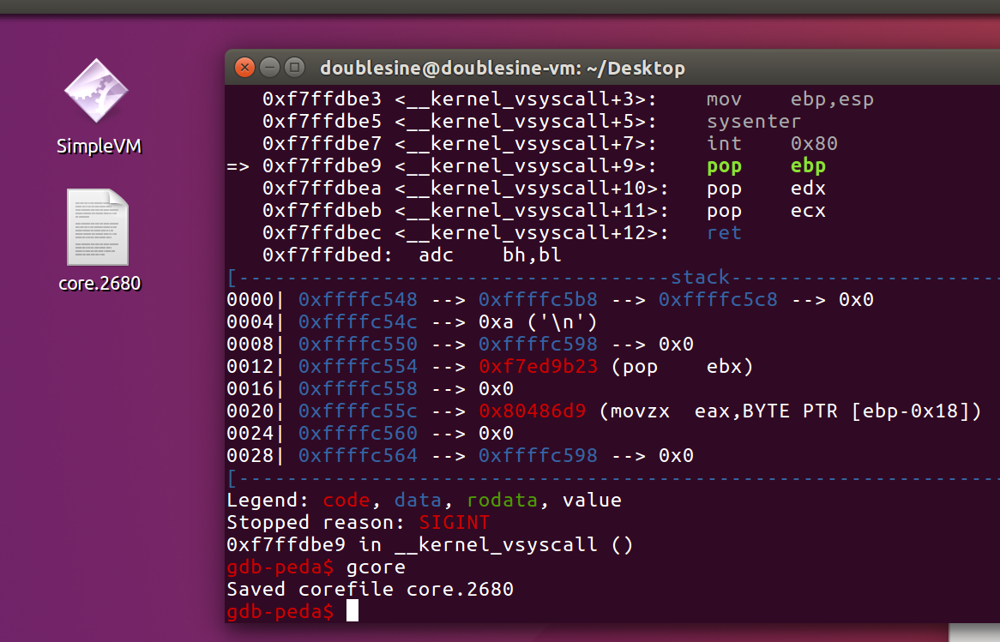
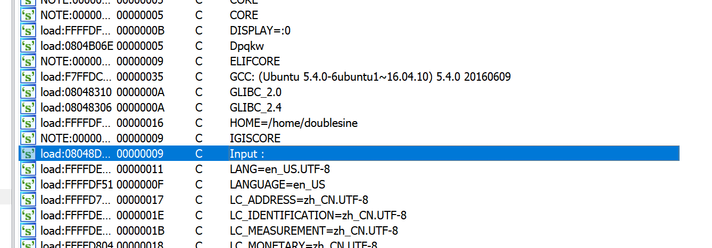
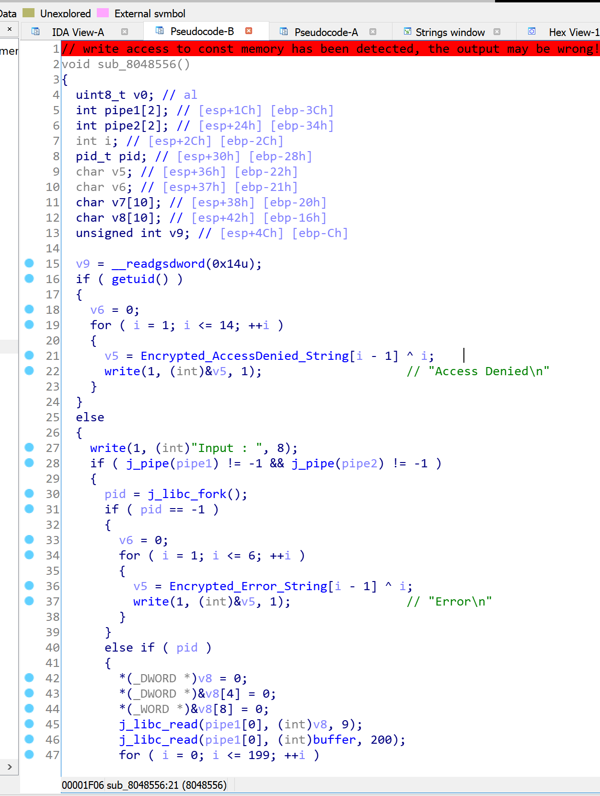
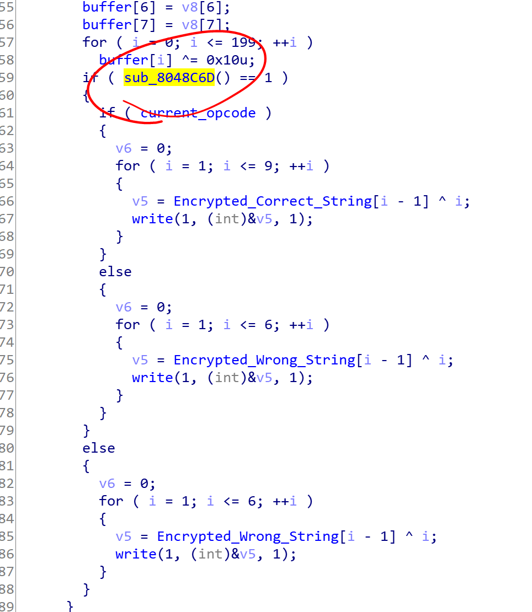
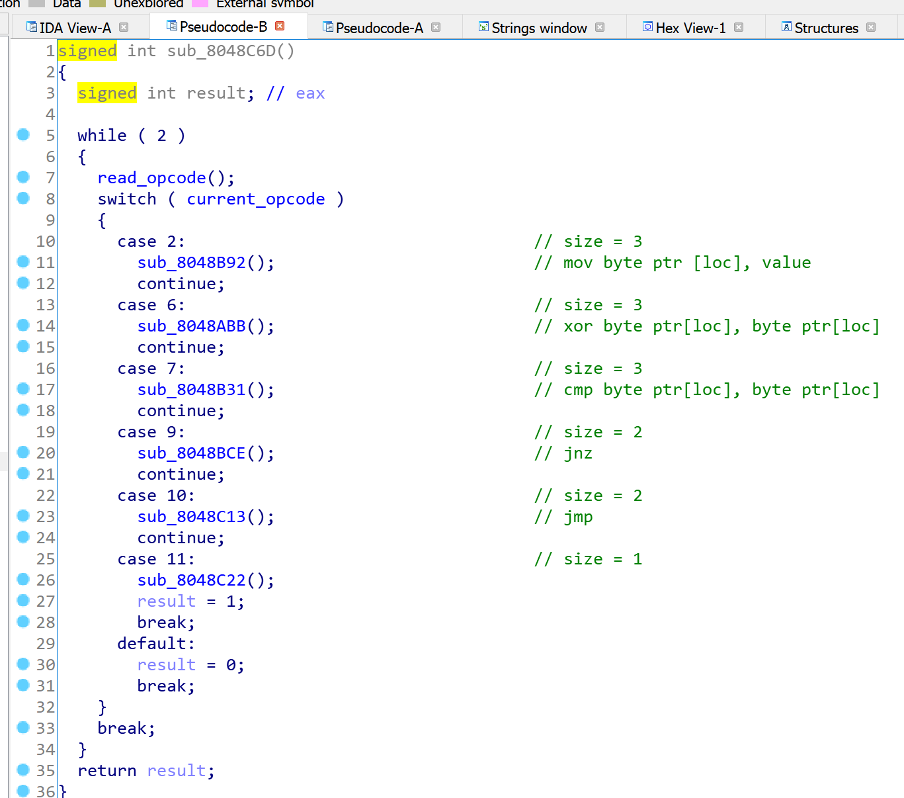

# Reversing.kr -- SimpleVM

## 1. Challenge

Just a file `SimpleVM`

Please goto [http://reversing.kr/challenge.php](http://reversing.kr/challenge.php) to download.

## 2. Solution

Drop it into IDA. But IDA reports an error saying invalid entry point. 

So I run this program in Ubuntu and use `gcore` dump the process out.



Drop the file `core.2680` to IDA and now you can see some functions. 

`Shift + F12` to pop `Strings window` and you will find there is a string `Input:`



You will find the string is referenced at `sub_8048556`



However, some external functions are called in `sub_8048556`. Though GOT table is broken, I believe that you can figure out the corresponding symbols. The picture above is an example. 

The VM function is `sub_8048C6D` and I figured out how it works. Here I give you some hits:

1. Let `buffer` be 200 bytes read from child process that is generated by `fork()`. `buffer[0]` ~ `buffer[7]` are chars that you input.

2. `buffer[8]` should be __Zero Flag__.

3. `buffer[9]` should be __IP register__.

4. VM opcodes should start from `buffer[10]`. 





I've written a python script `print_persuade_asm.py` to disassembly opcodes stored in `0x0804B0A0`.

```bash
$ ./print_persuade_asm.py
loc_0000000a    0a06      jmp loc_00000010
loc_0000000c    060000    xor byte ptr[0], byte ptr[0]
loc_0000000f    0b        hlt
loc_00000010    020760    mov byte ptr[7], 0x60
loc_00000013    060007    xor byte ptr[0], byte ptr[7]
loc_00000016    020709    mov byte ptr[7], 0x09
loc_00000019    070007    cmp byte ptr[0], byte ptr[7]
loc_0000001c    0902      jnz loc_0000000c
loc_0000001e    020766    mov byte ptr[7], 0x66
loc_00000021    060107    xor byte ptr[1], byte ptr[7]
loc_00000024    020702    mov byte ptr[7], 0x02
loc_00000027    070107    cmp byte ptr[1], byte ptr[7]
loc_0000002a    0902      jnz loc_0000000c
loc_0000002c    020715    mov byte ptr[7], 0x15
loc_0000002f    060207    xor byte ptr[2], byte ptr[7]
loc_00000032    020726    mov byte ptr[7], 0x26
loc_00000035    070207    cmp byte ptr[2], byte ptr[7]
loc_00000038    0902      jnz loc_0000000c
loc_0000003a    020707    mov byte ptr[7], 0x07
loc_0000003d    060307    xor byte ptr[3], byte ptr[7]
loc_00000040    02072d    mov byte ptr[7], 0x2d
loc_00000043    070307    cmp byte ptr[3], byte ptr[7]
loc_00000046    0902      jnz loc_0000000c
loc_00000048    02074c    mov byte ptr[7], 0x4c
loc_0000004b    060407    xor byte ptr[4], byte ptr[7]
loc_0000004e    020722    mov byte ptr[7], 0x22
loc_00000051    070407    cmp byte ptr[4], byte ptr[7]
loc_00000054    0902      jnz loc_0000000c
loc_00000056    020763    mov byte ptr[7], 0x63
loc_00000059    060507    xor byte ptr[5], byte ptr[7]
loc_0000005c    020707    mov byte ptr[7], 0x07
loc_0000005f    070507    cmp byte ptr[5], byte ptr[7]
loc_00000062    0902      jnz loc_0000000c
loc_00000064    020778    mov byte ptr[7], 0x78
loc_00000067    060607    xor byte ptr[6], byte ptr[7]
loc_0000006a    020710    mov byte ptr[7], 0x10
loc_0000006d    070607    cmp byte ptr[6], byte ptr[7]
loc_00000070    0902      jnz loc_0000000c
loc_00000072    020001    mov byte ptr[0], 0x01
loc_00000075    0b        hlt
```

Now it seems to be clear:

```python
flag = []

flag.append(0x09 ^ 0x60)
flag.append(0x02 ^ 0x66)
flag.append(0x26 ^ 0x15)
flag.append(0x2d ^ 0x07)
flag.append(0x22 ^ 0x4c)
flag.append(0x07 ^ 0x63)
flag.append(0x10 ^ 0x78)

flag = bytes(flag).decode()
print(flag)
```

The flag is __id3*ndh__

