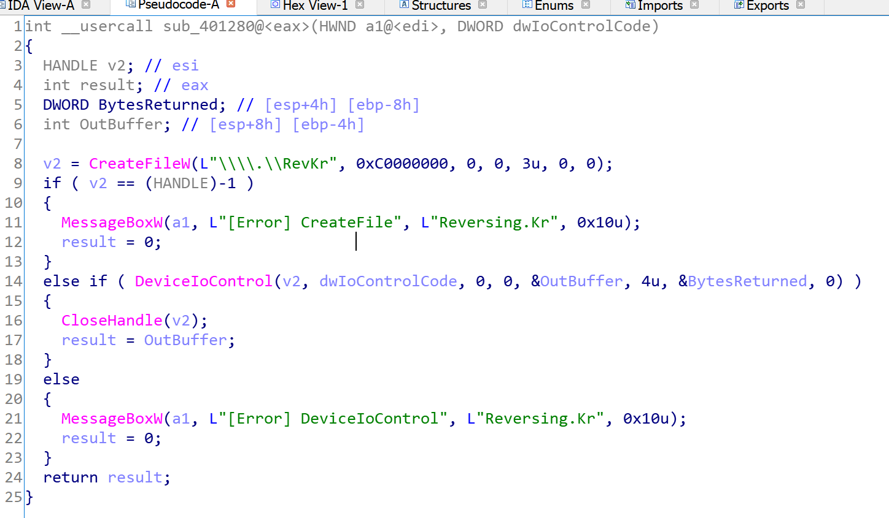

# Reversing.kr -- WindowsKernel

## 1. Challenge

3 files: `WindowsKernel.exe`, `WinKer.sys` and `ReadMe.txt`

> Reversing.Kr CrackMe - WindowsKernel  
>   
> Please authenticate to lowercase.  

Please goto [http://reversing.kr/challenge.php](http://reversing.kr/challenge.php) to download.

## 2. Solution

My OS is Win10 x64 so I cannot load this sys driver for `WinKer.sys` does not have a digital signature as well as this driver is a 32-bits driver. 

Let's see `WindowsKernel.exe` first. Drop it into IDA and search string `Correct`. You will find that the string `Correct` is referenced at `sub_401110`.

`sub_401280` is a function that is used to communicate with `WinKer.sys` through `DeviceIoControl`. The return value should be a `BOOL` returned by `WinKer.sys`.

The IO control codes used is `0x2000` and `0x1000`. So let's go to see `DeviceControlRoutine` in `WinKer.sys`.

In `DeviceControlRoutine`, there are some global variables. We can see that `WinKer.sys` returns the value of `C` when the control code is `0x2000` which will determine `Correct` or `Wrong`.

The global variable `C` is referenced inside `sub_111DC` of `WinKer.sys`. `sub_111DC` receives a char and is called in `sub_11266` only. 

`READ_PORT_UCHAR` means read an unsigned char from port 60 which will return scancodes of PS/2 keyboard.

You can find scancodes-keys map table from [https://wiki.osdev.org/PS/2_Keyboard](https://wiki.osdev.org/PS/2_Keyboard)

Here I show my comments so you can see what the flag is:

The flag is __keybdinthook__

